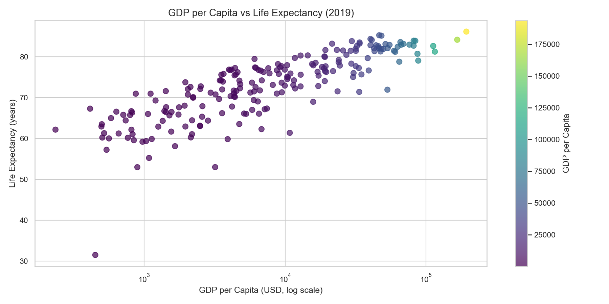
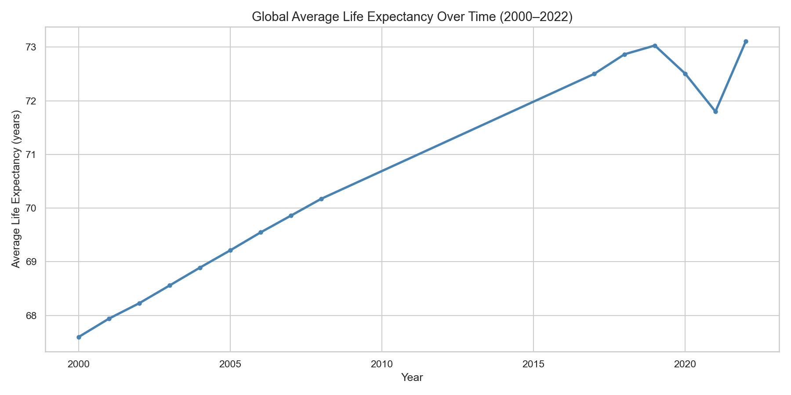
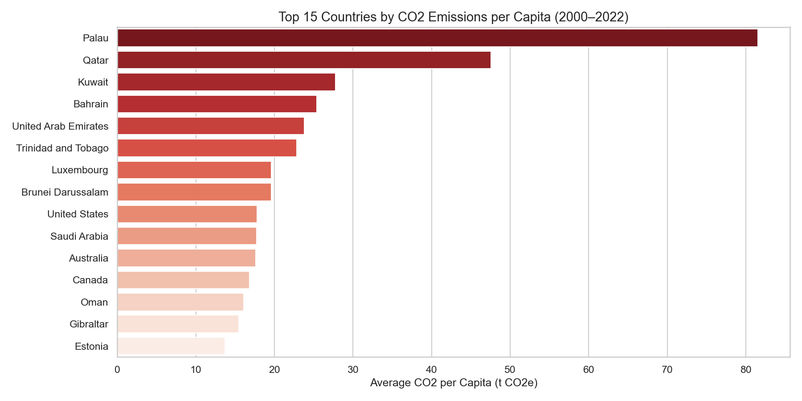
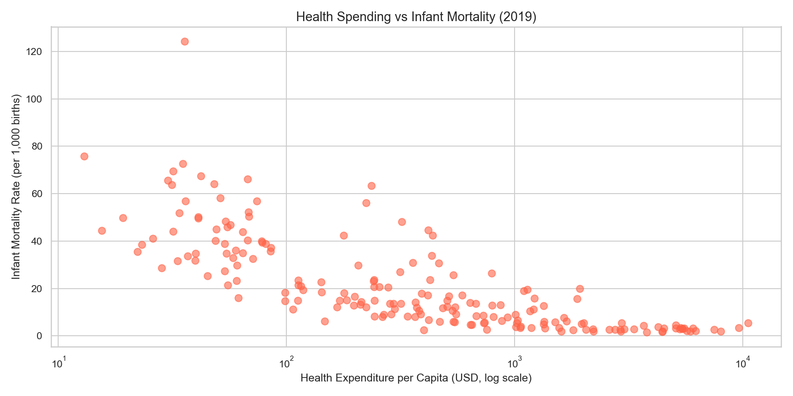
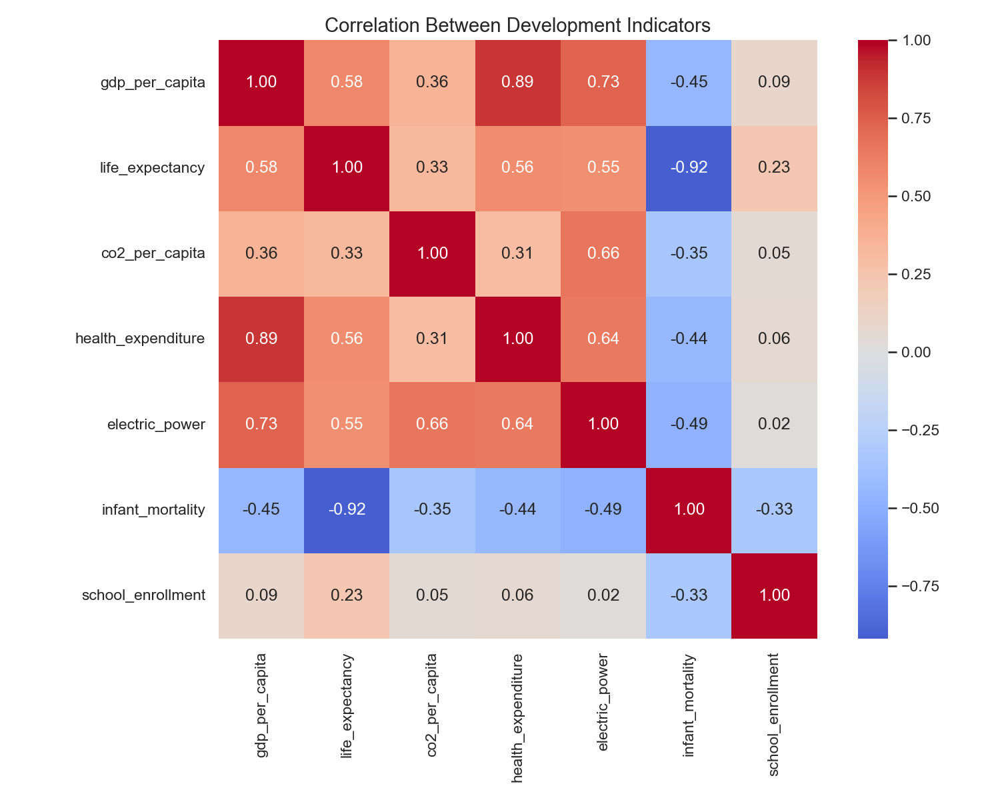

# 🌍 What Drives Human Wellbeing? A Global EDA


## 📌 Overview
An end-to-end exploratory data analysis of global human development using
World Bank data, uncovering what economic, health, and environmental factors
drive human wellbeing across **217 countries** from **2000 to 2022**.

---

## 🎯 Key Questions Answered
- 💰 Does money buy a longer life?
- 🌱 Is the world actually getting healthier over time?
- 🏭 Who are the real climate villains per capita?
- 🏥 Does healthcare spending actually save lives?
- 🔗 How do all development indicators relate to each other?

---

## 📊 Dataset
- **Source:** [World Bank — World Development Indicators](https://databank.worldbank.org/source/world-development-indicators)
- **Coverage:** 217 countries, 2000–2022
- **Indicators used:**

| Indicator | Description |
|---|---|
| GDP per capita (current US$) | Economic wealth per person |
| Life expectancy at birth (years) | Overall health outcome |
| Infant mortality rate (per 1,000 births) | Healthcare quality |
| Health expenditure per capita (US$) | Healthcare investment |
| School enrollment, primary (% gross) | Education access |
| CO2 emissions per capita (t CO2e) | Environmental cost |
| Electric power consumption (kWh) | Infrastructure proxy |
| Population, total | Scale and context |

---

## 🔍 Key Findings

### 1. Money Buys Life — But With Diminishing Returns

> Going from $1,000 to $10,000 GDP per capita adds roughly 20 years of life expectancy.
> Going from $50,000 to $100,000 barely moves the needle.

---

### 2. The World Got Healthier — Until COVID Hit

> Global average life expectancy rose steadily from 2000 to 2019.
> The dip around 2020–2021 is the COVID-19 signature in the data.

---

### 3. Small Oil Nations Are the Biggest Polluters Per Capita

> Qatar, Kuwait, and UAE top the list — not China or the USA.
> Per capita metrics reveal a very different story than total emissions.

---

### 4. Healthcare Spending Saves Lives

> Countries spending $10/person/year on health have infant mortality rates
> 10–20x higher than countries spending $5,000/person/year.

---

### 5. Development Indicators Are Deeply Interconnected

> GDP, electricity access, life expectancy, and health spending rise together.
> Infant mortality is the clearest signature of underdevelopment.

---

## 🗂️ Project Structure
world-development-eda/
├── data/
│   └── wdi_clean.csv        # Cleaned dataset
├── src/
│   ├── load_data.py         # Data loading and exploration
│   ├── clean_data.py        # Data cleaning and feature engineering
│   └── visualize.py         # All visualizations
├── outputs/                 # Generated charts
├── main.py                  # Main pipeline
└── requirements.txt         # Dependencies

---

## 🚀 How to Run
```bash
# 1. Clone the repo
git clone https://github.com/Heran-Am/world-development-eda.git
cd world-development-eda

# 2. Install dependencies
pip install -r requirements.txt

# 3. Run the full pipeline
python main.py
```

---

## 🛠️ Tools & Libraries
- **Python 3.11**
- **Pandas** — data manipulation
- **Matplotlib** — base visualizations
- **Seaborn** — statistical plots

---

## 👤 Author
**Heran** — MSc Data Science Student  
[GitHub](https://github.com/Heran-Am)
